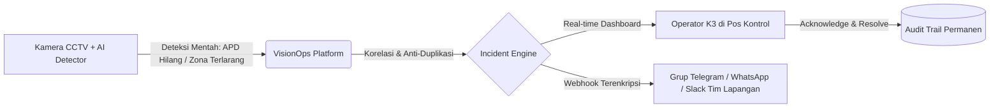

# PRODUCT REQUIREMENTS DOCUMENT (PRD)
## VisionOps — Workplace Safety Operations Platform

| Field | Value |
| :--- | :--- |
| **PRD Version** | v1.0 |
| **Status** | Approved / Baseline |
| **Product Owner** | Safety Tech Lead / Nabbil |
| **Target Release** | v1.0.0 (MVP) |
| **Target Audience** | Non-Technical Stakeholders, Operations Managers, Safety Leads, Engineers |
| **Last Updated** | September 2026 |

---

## 1. Executive Summary & Problem Context (Non-Technical Friendly)

### 1.1 Latar Belakang & Masalah di Lapangan
Di lingkungan operasional berisiko tinggi (pabrik manufaktur, area konstruksi, pergudangan, dan dermaga), kepatuhan keselamatan kerja (K3/HSE) adalah prioritas utama. Pelanggaran seperti pekerja tidak memakai helm/rompi APD, memasuki zona berbahaya (*restricted area*), atau terjadinya kerumunan (*crowding*) sering kali terlambat terdeteksi.

Meskipun kamera CCTV berbasis AI sudah mulai banyak dipasang, **tantangan terbesarnya bukan pada deteksi AI-nya, melainkan alur tindak lanjut di lapangan**:
1. **AI Fatigue & Noisy Alerts**: Deteksi AI yang terlalu sensitif membanjiri petugas dengan ratusan notifikasi mentah yang tidak terorganisir.
2. **Hilangnya Akuntabilitas**: Tidak ada pencatatan resmi tentang *siapa* petugas yang merespons, *kapan* peringatan diakui (*acknowledged*), dan *bagaimana* status penyelesaiannya (*resolved*).
3. **Ketiadaan Audit Trail**: Saat terjadi investigasi kecelakaan kerja, manajemen kesulitan membuktikan apakah sistem peringatan dini bekerja dan apakah ada kelalaian operasional.

### 1.2 Solusi: VisionOps
**VisionOps** hadir bukan sebagai pemroses video/AI inference engine, melainkan sebagai **Platform Manajemen Operasional Keselamatan Kerja (Safety Incident Operations)**.

VisionOps menjembatani deteksi AI mentah dari kamera menjadi **alur insiden nyata yang terstruktur, terpantau secara *real-time*, dan dapat dipertanggungjawabkan**.

---

## 2. Product Goals & Success Metrics

### 2.1 Tujuan Utama (Product Goals)
- **Mengubah Noise Menjadi Insiden Operasional**: Mengelompokkan deteksi beruntun dari kamera yang sama dalam jendela waktu tertentu menjadi 1 tiket insiden terpadu.
- **Transparansi Respon Lapangan**: Memberikan visibilitas langsung kepada manajer pos kontrol terhadap setiap insiden terbuka.
- **Notifikasi Andal Tanpa Kehilangan Data**: Menjamin setiap alert darurat terkirim ke sistem eksternal dengan jaminan pengiriman ulang (*retry & dead-letter queue*).
- **Kesiapan Audit Regulasi K3**: Menyediakan riwayat log lengkap untuk keperluan pelaporan regulasi keselamatan kerja.

### 2.2 Metrik Keberhasilan (Success Metrics)
| Metrik | Target | Cara Mengukur |
| :--- | :--- | :--- |
| **Pengurangan Notifikasi Duplikat** | $\ge 80\%$ pengurangan tiket ganda | Deteksi berturut-turut dalam 5 menit dikelompokkan ke insiden aktif yang sama. |
| **Kecepatan Respon (MTTA)** | $< 3$ menit rata-rata waktu *acknowledge* | Selisih waktu deteksi masuk hingga operator menekan tombol *Acknowledge*. |
| **Keandalan Pengiriman Webhook** | $99.9\%$ delivery rate sukses | Menggunakan *Transactional Outbox Pattern* dengan mekanisme retry otomatis. |
| **Audit Coverage** | $100\%$ aksi operator tercatat | Setiap login, acknowledge, resolve, dan replay tercatat di log aktivitas audit. |

---

## 3. User Personas & Core Journeys

| Persona | Peran & Tanggung Jawab | Kebutuhan Utama di VisionOps |
| :--- | :--- | :--- |
| **Budi (Petugas Lapangan / HSE Officer)** | Memantau dashboard harian di pos kontrol, merespons alarm K3. | Dashboard visual yang simpel, auto-update tanpa refresh (*real-time*), tombol satu-klik untuk "Terima Insiden" dan "Selesaikan". |
| **Siti (Safety Manager / HSE Lead)** | Mengawasi kepatuhan SOP pabrik, mereview insiden mingguan, audit regulasi. | Laporan rekapitulasi pelanggaran per area, evaluasi respon waktu tim, dan ekspor data audit. |
| **Rian (Integrator / IT Ops)** | Menghubungkan kamera AI baru dan webhook ke platform internal. | Endpoint API yang aman (API Key, HMAC signed webhook), dokumentasi API yang jelas, dan panel replay jika koneksi sempat putus. |

---

## 4. Scope & Feature Requirements (MoSCoW)

### 4.1 Must Have (Wajib Ada di v1.0)
- **Ingestion API**: Endpoint aman menerima event deteksi (`POST /api/v1/ingest/detections`) dengan API Key autentikasi.
- **Incident Aggregation & Deduplication**: Otomatis membuat insiden baru atau mengaitkan deteksi ke insiden aktif (jika tipe pelanggaran & kamera sama dalam batas toleransi waktu 5 menit).
- **Incident Lifecycle State Machine**:
  - `OPEN` $\rightarrow$ `ACKNOWLEDGED` $\rightarrow$ `RESOLVED`
- **Real-Time Web Dashboard**: Tampilan daftar insiden berbasis Server-Sent Events (SSE) yang update seketika tanpa perlu reload halaman.
- **Guaranteed Webhook Dispatcher**: Pengiriman webhook notifikasi dengan tanda tangan kriptografis HMAC SHA-256 dan outbox worker.
- **Role-Based Access Control (RBAC)**: Pemisahan hak akses antara `Admin`, `Operator`, dan `Viewer`.
- **Audit Logging**: Pencatatan aktivitas tidak dapat diubah (*immutable history*).

### 4.2 Should Have (Direkomendasikan)
- **Dead-Letter Queue (DLQ) & Manual Replay**: Panel khusus untuk melihat pengiriman webhook yang gagal lebih dari 5x dan opsi pengiriman ulang manual.
- **Filter Multi-Lokasi / Multi-Kamera**: Penyaringan insiden berdasarkan zona bahaya (misal: "Gudang B", "Pintu Masuk Loading Dock").

### 4.3 Out of Scope (Bukan Tanggung Jawab VisionOps Backend)
- **Video Stream Decoding / Computer Vision Inference**: Pemrosesan video MP4/RTSP dan model AI (YOLO/PyTorch) berjalan di edge service terpisah.
- **Sistem Absensi Karyawan / Payroll**: Sistem murni untuk kepatuhan K3 dan operasional keselamatan kerja.

---

## 5. Non-Functional Requirements (NFR)

| Kategori | Standar Spesifikasi |
| :--- | :--- |
| **Performance** | Ingestion response time $P95 < 25\text{ms}$ untuk beban hingga 500 deteksi/detik. |
| **Reliability** | *Zero data loss* pada event deteksi yang berhasil diterima API melalui transaksi database ACID. |
| **Security** | Payload webhook ditandatangani HMAC SHA-256; API Key dilindungi hash; endpoint terlindungi dari SQL Injection & XSS. |
| **Usability** | Desain antarmuka responsif, kontras tinggi, dan ramah pengguna non-teknis pada layar monitor kontrol pos keamanan. |
