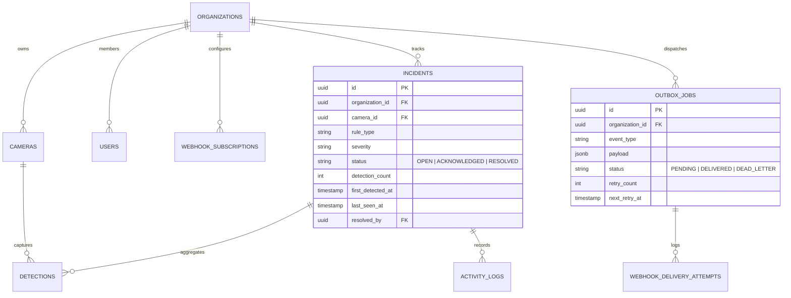

# SOFTWARE ARCHITECTURE DOCUMENT (SAD)
## VisionOps — Architecture & System Design Overview

| Field | Value |
| :--- | :--- |
| **Document Version** | v1.0 |
| **Status** | Approved |
| **Architecture Lead** | Nabbil / VisionOps Engineering |
| **System Style** | Modular Go Monolith + Background Worker + Edge AI Decoupling |
| **Target Baseline** | Go 1.22+, PostgreSQL 16 / SQLite 3, Tailwind/Vanilla SSE UI |
| **Last Updated** | September 2026 |

---

## 1. Context & Architectural Boundary (C4 Level 1)

VisionOps menerapkan prinsip **Loose Coupling** antara lapisan pemrosesan computer vision (Edge) dan lapisan bisnis operasional (Backend).

```mermaid
flowchart TB
    subgraph EdgeLayer["Edge / Camera Layer (Outside VisionOps)"]
        Cam1[CCTV Camera 1]
        Cam2[CCTV Camera 2]
        AI[AI Camera Service / Simulator]
        Cam1 --> AI
        Cam2 --> AI
    end

    subgraph VisionOpsPlatform["VisionOps Platform Boundary"]
        API[VisionOps HTTP API]
        Worker[Outbox Dispatcher Worker]
        DB[(PostgreSQL / SQLite Database)]
        UI[Operations Web Dashboard]

        API <--> DB
        Worker <--> DB
        UI <-->|HTTP REST & SSE Stream| API
    end

    subgraph ExternalSystems["External Integration"]
        Slack[Slack / Telegram Webhook]
        PagerDuty[PagerDuty / OpsGenie]
    end

    AI -->|POST /api/v1/ingest/detections (API Key + HMAC)| API
    Worker -->|Signed Webhook Deliveries| ExternalSystems
```

---

## 2. Container & Component Architecture (C4 Level 2)

### 2.1 Component Breakdown
1. **HTTP Ingestion API**:
   - Menerima payload deteksi dari Edge AI/Simulator.
   - Melakukan validasi schema dan verifikasi API Key organisasi.
   - Menjamin idempoten berdasarkan `event_id`.
2. **Incident Aggregation Engine**:
   - Mencari apakah ada tiket insiden yang masih `OPEN` untuk kombinasi `(organization_id, camera_id, rule_type)` dalam rentang window 5 menit.
   - Jika ada: menaikkan count agregasi, memperbarui timestamp `last_seen_at`.
   - Jika tidak ada: membuat tiket `incident` baru dengan status `OPEN`.
3. **Transactional Outbox Engine**:
   - Dalam **1 transaksi database yang sama (ACID)** dengan pembuatan insiden:
     - Record `detections` tersimpan.
     - Record `incidents` dibuat/diupdate.
     - Record `activity_logs` dicatat (audit).
     - Record `outbox_jobs` dimasukkan untuk siap dikirim ke webhook.
   - Mencegah *dual-write problem* (situasi database sukses tapi notifikasi gagal atau sebaliknya).
4. **Outbox Worker Process**:
   - Berjalan sebagai background daemon.
   - Mengambil job berstatus `pending` menggunakan query `SELECT ... FOR UPDATE SKIP LOCKED` (aman untuk multi-worker concurrency).
   - Mengirim HTTP POST ke endpoint webhook dengan signature `X-VisionOps-Signature` (HMAC SHA-256).
   - Jika gagal: melakukan exponential backoff ($2^n$ detik). Maksimal 5x percobaan sebelum masuk status `dead_letter`.
5. **Real-time SSE Hub**:
   - Membuka koneksi `text/event-stream` ke browser operator.
   - Memancarkan event `incident_created`, `incident_updated`, `incident_resolved` secara instan ke UI.

---

## 3. Data Architecture & Entity Relationship (ERD)



---

## 4. Key Cross-Cutting Concerns

- **Security**: Autentikasi berbasis Bearer Token / Session Cookie untuk Web UI; API Key hashing untuk endpoint Ingestion; HMAC SHA-256 signature pada setiap payload Webhook.
- **Observability**: Structured logging, the database-aware `GET /health` endpoint, and operational counters for webhook failures and camera health. Readiness, metrics export, and production log configuration remain future work.
- **Portability**: Dukungan dual database engine (SQLite dengan WAL mode untuk development/single-node demo, PostgreSQL untuk deployment enterprise).
