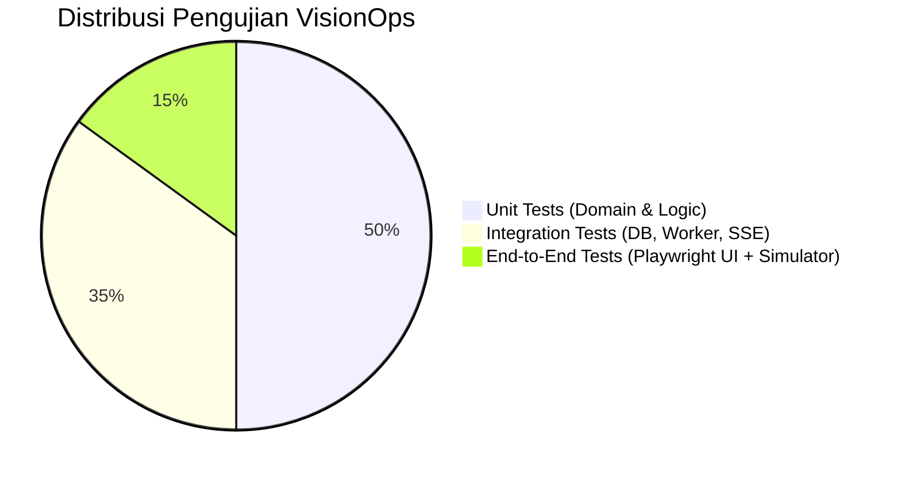

# QA & TEST PLAN
## VisionOps — Quality Assurance & Verification Plan

| Field | Value |
| :--- | :--- |
| **Test Plan Version** | v1.0 |
| **Status** | Ready |
| **QA / Tech Lead** | Nabbil |
| **Target Release** | v1.0.0 |
| **Test Frameworks** | Go standard `testing`, Playwright (E2E Web UI), Testcontainers / SQLite in-memory |
| **Last Updated** | September 2026 |

---

## 1. Testing Strategy Pyramid

---

## 2. Test Suites & Coverage Matrix

| Area Pengujian | Cakupan & Skenario Uji | Tool / Runner | Acceptance Criteria |
| :--- | :--- | :--- | :--- |
| **Ingestion Validation** | Format JSON payload, API key invalid, missing required fields, boundary payload size. | `go test ./internal/ingest/...` | Mengembalikan HTTP 400/401 dengan pesan error terstruktur. |
| **Deduplication Logic** | Mengirimkan 5 deteksi berturut-turut dari kamera & rule yang sama dalam rentang 30 detik. | `go test ./internal/incidents/...` | Hanya 1 insiden dibuat; counter `detection_count` bernilai 5. |
| **Outbox Worker & Retries** | Simulasi endpoint webhook tujuan mengembalikan status 500 / Connection refused. | `go test ./internal/outbox/...` | Worker melakukan backoff retry hingga 5x, lalu memindahkan job ke status `dead_letter`. |
| **SSE Stream Reliability** | Koneksi browser menerima broadcast saat insiden baru tercipta. | `go test ./internal/sse/...` | Event diterima client dalam waktu $< 100\text{ms}$ setelah commit DB. |
| **Role-Based Access** | User dengan role `Viewer` mencoba menekan tombol "Resolve Incident". | `go test ./internal/auth/...` | Mengembalikan status HTTP 403 Forbidden; aksi ditolak. |
| **E2E Operator Flow** | Skenario lengkap: Buka Dashboard $\rightarrow$ AI Simulator kirim deteksi $\rightarrow$ Insiden muncul di layar $\rightarrow$ Operator klik Acknowledge $\rightarrow$ Klik Resolve. | `npx playwright test` | UI terupdate secara real-time tanpa manual page reload. |

---

## 3. Critical Failure Scenarios (Chaos & Resilience)

1. **Database Disconnect Saat Ingestion**:
   - *Ekspektasi*: Transaksi rollback otomatis; API mengembalikan HTTP 503; tidak ada data setengah-tersimpan (*no dirty state*).
2. **Crash Outbox Worker Saat Pengiriman Webhook**:
   - *Ekspektasi*: Baris job yang di-lock dengan `FOR UPDATE SKIP LOCKED` otomatis dilepas oleh database saat koneksi terputus. Worker baru atau restart dapat langsung mengambil ulang job tersebut.
