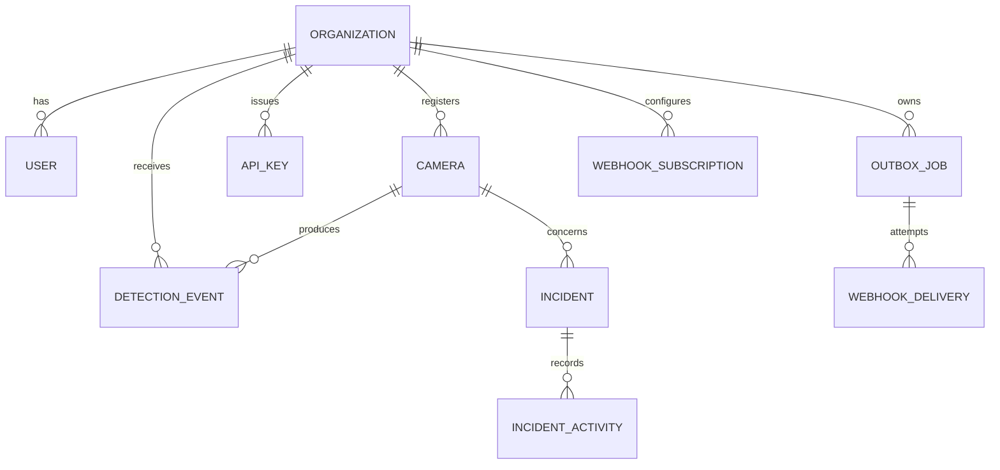

# VisionOps Data and API Contract

## Domain Relationships



## Canonical States

| Resource | States | Transition |
| --- | --- | --- |
| Incident | `open`, `acknowledged`, `resolved` | ingest -> open; acknowledge: open -> acknowledged; resolve: open/acknowledged -> resolved |
| Camera health | `online`, `degraded`, `offline` | heartbeat under 5m -> online; stale heartbeat -> degraded; no heartbeat -> offline |
| Outbox job | `pending`, `processing`, `done`, `dead` | worker claim/delivery; up to five failed attempts -> dead; replay: dead -> pending |

## HTTP Contract

Base URL: `/api/v1`. JSON responses use `{ "error": "..." }` for known client/server failures. The current compact machine-readable file remains [`web/openapi.yaml`](../web/openapi.yaml); this document specifies behavior missing from its initial summary.

| Endpoint | Auth | Behavior |
| --- | --- | --- |
| `POST /auth/login` | none | `{email,password}` -> signed bearer token valid for 8h in the demo. |
| `POST /ingest/detections` | `X-API-Key` | Requires `event_id`, `camera_id`, `rule`; optional severity, observed time, metadata. Returns `202` accepted / `200` duplicate. |
| `GET /ingest/cameras` | `X-API-Key` | Producer discovery of registered Cameras in its own organization only. |
| `POST /ingest/camera-heartbeats` | `X-API-Key` | Requires `camera_id`; returns `202` when a tenant-owned camera is updated. |
| `GET /incidents?limit=1..100` | bearer | Tenant-scoped list, newest `last_seen_at` first. |
| `GET /incidents/{id}` | bearer | Tenant-scoped incident and activity for every human role. |
| `POST /incidents/{id}/acknowledge` | admin/operator | Optional `{note}`; only `open` may transition. |
| `POST /incidents/{id}/resolve` | admin/operator | Optional `{note}`; open/acknowledged may transition. |
| `GET/POST /cameras` | bearer/admin for POST | Lists camera health; Admin creates with `{name,location}`. |
| `GET/POST /users`, `/api-keys`, `/webhooks` | admin | Organization configuration. Raw API key only returns once at creation. |
| `GET /jobs`, `/deliveries`, metrics endpoints | bearer | Tenant-scoped operational inspection. |
| `POST /jobs/{id}/replay` | admin/operator | Only dead job can become pending. |
| `GET /events` | bearer | Server-sent live update stream; clients must reconnect. |

## Integration Contract: AI Camera Service

```json
{
  "event_id": "producer-unique-event-id",
  "camera_id": "uuid",
  "rule": "missing_ppe",
  "severity": "high",
  "observed_at": "2026-09-01T08:00:00Z",
  "metadata": { "confidence": 0.93 }
}
```

- `event_id` is an idempotency key per organization. Producers must reuse it on retries.
- `camera_id` must already be registered to the key's organization.
- Accepted rules today: `missing_ppe`, `restricted_area`, `crowding`.
- Producer retries must use bounded exponential backoff for network failures and `5xx`; do not retry `400`, `401`, or `429` blindly.
- Send a heartbeat at an interval shorter than five minutes. Heartbeats establish service health, not a safety detection.

## Data Ownership and Retention Plan

Current demo stores synthetic operational events indefinitely in the local database. Before production, define tenant-specific retention for Detections, Incidents, audit activity, and delivery logs; apply legal/privacy review before adding media references. Never put raw video or identifiable images in `metadata`.
